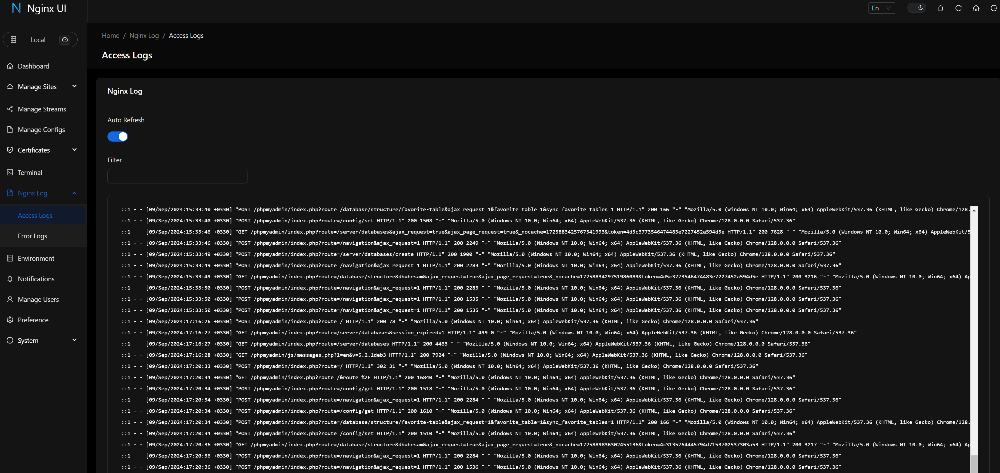
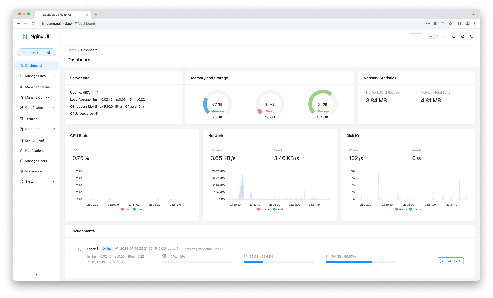
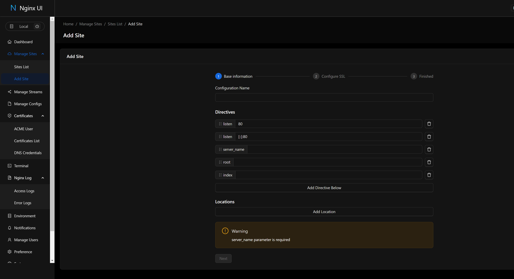

# Installation Instructions
This repository provides a comprehensive guide and scripts for setting up a Linux, Nginx, MySQL, and PHP (LNMP) stack. It includes detailed instructions for installing and configuring Nginx, MySQL, phpMyAdmin, and other necessary tools on both Linux and Windows Subsystem for Linux (WSL).

## Features

- **Nginx Installation and Configuration**: Step-by-step instructions to install and configure Nginx.
- **MySQL Setup**: Guide to install MySQL, set up the root user, and configure phpMyAdmin.
- **WSL Support**: Instructions tailored for users running WSL.
- **Automation Scripts**: Scripts to automate domain creation and removal.
- **Dependency Installation**: Instructions to install Golang, Node.js, and pnpm.
- **Nginx UI**: Guide to install and configure Nginx UI for easier management.
- **Online statistics**: Server indicators such as CPU usage, memory usage, load average, and disk usage.
- **Online ChatGPT Assistant**: Integrated ChatGPT assistant for help.
- **One-click deployment**: Automatic renewal of Let's Encrypt certificates.
- **Online editing**: Websites configurations with NgxConfigEditor or Ace Code Editor.
- **Nginx logs**: Online view of Nginx logs.
- **Web Terminal**: Access terminal via web interface.
- **Dark Mode**: Support for dark mode.
- **Responsive Web Design**: Mobile-friendly design.
- **Internationalization**: Support for multiple languages.


## Update and Install Nginx

```bash
sudo apt update
sudo apt install nginx
sudo systemctl start nginx
sudo systemctl enable nginx
sudo systemctl status nginx
```

## For WSL (Windows Subsystem for Linux)

### Clone the Repository

```bash
git clone https://github.com/morpheusadam/LNMP.git
cd LNMP
```

### Copy and Set Up Scripts

```bash
sudo cp dg.sh /usr/local/bin/dg
sudo cp dr.sh /usr/local/bin/dr
sudo chmod +x /usr/local/bin/dg
sudo chmod +x /usr/local/bin/dr
```
### Copy and Set Up Scripts

### If Using WSL or Linux, Follow These Steps to Create or Remove Domains
## Create a Domain on Your Linux or WSL

```bash
sudo dg
```

## Remove a Domain on Your Linux or WSL

```bash
sudo dr
```


## Install Dependencies

### Install Golang

```bash
sudo apt-get install golang
```
### Install Node.js

```bash
curl -sL https://deb.nodesource.com/setup_21.x | sudo -E bash -
sudo apt-get install -y nodejs
```

### Install pnpm

```bash
npm install -g pnpm
```


## Install Nginx UI

### Download and Run the Install Script
```bash
curl -L -o install.sh https://raw.githubusercontent.com/0xJacky/nginx-ui/master/install.sh
chmod +x install.sh
sudo ./install.sh install
```

### Create Your Account
Follow the instructions to create your account.

### Start and Restart Nginx UI
```bash
sudo systemctl start nginx-ui
sudo systemctl restart nginx-ui
```

## Access the Nginx UI Panel
Open your browser and go to:

http://127.0.0.1:9000/

For more settings and information, visit the [Nginx UI GitHub page](https://github.com/0xJacky/nginx-ui).


# Install phpMyAdmin & MySQL

## Update and Install MySQL

```bash
sudo apt update
sudo apt install mysql-server
```
### Start and Enable MySQL

```bash
sudo systemctl start mysql
sudo systemctl enable mysql
```
### Set Root User Password

```bash
sudo mysql
ALTER USER 'root'@'localhost' IDENTIFIED WITH mysql_native_password BY 'root';
FLUSH PRIVILEGES;
EXIT;
```

### Install phpMyAdmin and Required Extensions

```bash
sudo apt install phpmyadmin php-mbstring php-zip php-gd php-json php-curl
```


When prompted to choose a web server for automatic configuration, select "None" using the Tab key and press Enter.

## Configure Nginx for phpMyAdmin

### Edit Nginx Configuration File

```bash
sudo nano /etc/nginx/sites-available/default
```


Replace the configuration with the following and adjust the PHP version as needed:
[SAMPLE_DEFAULT `sample-default.php` on GitHub](https://github.com/morpheusadam/LNMP/blob/main/var/www/localhost/sample-default.php)


### Set Permissions and Ownership

```bash
sudo chmod -R 755 /usr/share/phpmyadmin
sudo chown -R www-data:www-data /usr/share/phpmyadmin

```

### Create a Symbolic Link for phpMyAdmin
```bash
sudo ln -s /usr/share/phpmyadmin /var/www/html/phpmyadmin
```

### Restart Services

```bash
sudo systemctl restart nginx
sudo systemctl restart mysql
```


You can now access phpMyAdmin at:

[http://localhost/phpmyadmin](http://localhost/phpmyadmin)

### Check PHP-FPM Status

```bash
sudo systemctl start php8.3-fpm
sudo systemctl status php8.3-fpm
```

### Create a Beautiful Landing Page for Nginx

You can use a beautiful landing page like the example below and place it as `index.php` in the `/var/www/localhost` directory:

[View `sample-index.php` on GitHub](https://github.com/morpheusadam/LNMP/blob/main/var/www/localhost/sample-index.php)


## Screenshots



